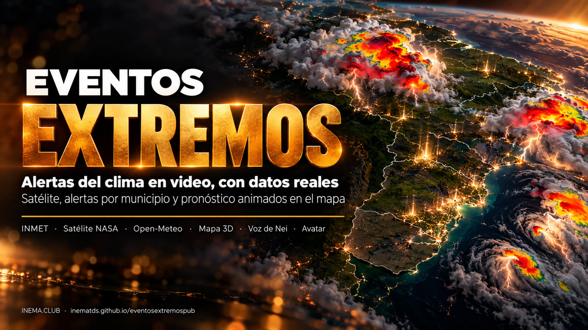

# eventosextremospub

[](https://inematds.github.io/eventosextremospub/guia/es/)

**🇧🇷 [Português](README.md) · 🇺🇸 [English](README.en.md) · 🇪🇸 [Español](README.es.md)**

## Qué es

eventosextremospub es un conjunto de scripts que convierte una alerta de tiempo severo en un video corto vertical (Reels, Shorts, TikTok). Descarga los datos de fuentes públicas: alertas del INMET con la lista de municipios, imágenes del satélite GOES-19 a través de la NASA y pronóstico de lluvia y viento de Open-Meteo. Después lo anima todo en un mapa 3D del sur de Brasil, con narración y subtítulos palabra por palabra. Es para quien produce contenido sobre clima y quiere números verificados, con la fuente en pantalla, en lugar de volver a publicar capturas de sitios web. Requiere una computadora con tarjeta de video, Node con Playwright, Python, ffmpeg y, para la voz, el proyecto cardshorts.

## 📖 Guía de uso

Guía completa (landing + paso a paso): **https://inematds.github.io/eventosextremospub/guia/es/**

## Detalles

Videos cortos 9:16 sobre **eventos climáticos extremos** al estilo "sala de crisis": mapa animado con datos reales (alertas por municipio, satélite, viento, lluvia pronosticada), cada número apareciendo en el instante en que se dice, narración con la voz de Nei y avatar.

El proyecto tiene tres partes:

1. **Noticias de fuente confiable** (`coleta/`, `fontes-clima.md`): INMET (avisos por municipio), NASA GIBS / NOAA GOES-19 (satélite), Open-Meteo (pronóstico en cuadrícula), MetSul, Defensa Civil. Cada número lleva fuente y horario, y lo que ya ocurrió queda separado del pronóstico.
2. **Animación que atrapa** (`motor/`): deck.gl en Chrome sin ventana, cuadro a cuadro, con la GPU (Vulkan, ~0,1 s por cuadro). Recursos:
   - municipios coloreados según el nivel de alerta;
   - columnas 3D;
   - timelapse del infrarrojo de las tormentas;
   - partículas de viento;
   - ríos dibujados poco a poco;
   - marcadores de ciudad;
   - contadores y subtítulos palabra por palabra.
3. **Avatar** (pendiente): HeyGen con los datos de explicavideo.

## Reglas de cada video

- El cuadro 0 ya viene lleno: fecha **dd/mm/aaaa** y el titular viral con el número más fuerte que tenga fuente (ej.: "HASTA 300 MM").
- Solo números con fuente, y la fuente aparece en pantalla.
- El texto hablado sigue el tono de Nei: directo, tuteando, con preguntas al espectador ("¿adónde vas a ir?"), preparación práctica y cierre en inema.club.

## Uso (una edición)

```bash
geo/baixar.sh && python3 motor/prep_geo.py                       # base geográfica (1 vez)
E=edicoes/2026-10-09-alerta-sul
python3 coleta/inmet_avisos.py $E                                 # alertas por município
python3 coleta/satelite_gibs.py $E --base 2026-10-08T18:00 --de 2026-10-08T12:00 --ate 2026-10-09T05:00
python3 coleta/openmeteo.py $E --dia 2026-10-09                   # chuva 7 dias + vento
# escreva $E/falas.json (as falas) e $E/base.md (a pesquisa)
python3 $E/narrar.py                                              # voz do Nei, conferida por transcrição
python3 $E/gerar_cena.py                                          # linha do tempo → cena.js
node motor/render.mjs $E --quadros 0,10,30                        # prévia de quadros
motor/montar.sh $E $E/video.mp4                                   # vídeo final
```

La voz usa el motor de [cardshorts](https://github.com/inematds/cardshorts) (Chatterbox + Whisper locales).

## Ediciones

| Fecha | Edición | Qué muestra |
|---|---|---|
| 09/10/2026 | `edicoes/2026-10-09-alerta-sul` | 529 ciudades en rojo (INMET), ráfaga de 109 km/h, 113 mm en São Borja, mapa del fin de semana, hasta 204 mm en 7 días (Open-Meteo) |

Licencia MIT. Los datos de terceros siguen las licencias de sus fuentes (INMET, NASA/NOAA, Open-Meteo, IBGE, Natural Earth).
