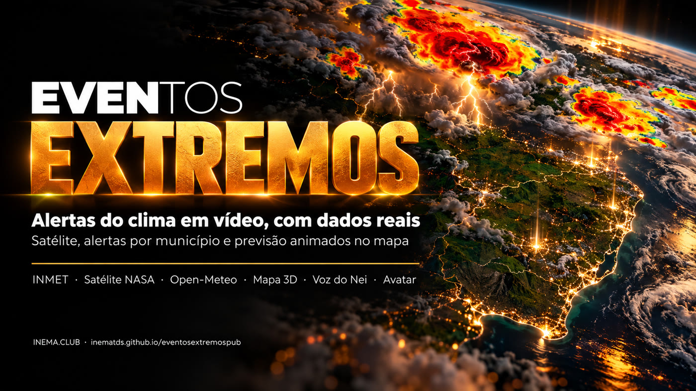

# eventosextremospub

[](https://inematds.github.io/eventosextremospub/guia/)

**🇧🇷 [Português](README.md) · 🇺🇸 [English](README.en.md) · 🇪🇸 [Español](README.es.md)**

## O que é

O eventosextremospub é um conjunto de scripts que transforma um alerta de tempo severo num vídeo curto vertical (Reels, Shorts, TikTok). Ele baixa os dados de fontes públicas: alertas do INMET com a lista de municípios, imagens do satélite GOES-19 pela NASA e previsão de chuva e vento do Open-Meteo. Depois anima tudo num mapa 3D do Sul do Brasil, com narração e legenda palavra a palavra. É para quem produz conteúdo sobre clima e quer números conferidos, com a fonte na tela, em vez de repostar print de site. Precisa de um computador com placa de vídeo, Node com Playwright, Python, ffmpeg e, para a voz, o projeto cardshorts.

## 📖 Guia de uso

Guia completo (landing + passo a passo): **https://inematds.github.io/eventosextremospub/guia/**

## Detalhes

Vídeos curtos 9:16 sobre **eventos extremos do clima** no estilo "sala de crise": mapa animado com dados reais (alertas por município, satélite, vento, chuva prevista), cada número aparecendo no instante em que é dito, narração com a voz do Nei e avatar.

O projeto tem três partes:

1. **Notícias de fonte segura** (`coleta/`, `fontes-clima.md`): INMET (avisos por município), NASA GIBS / NOAA GOES-19 (satélite), Open-Meteo (previsão em grade), MetSul, Defesa Civil. Cada número leva fonte e horário, e o que já aconteceu fica separado da previsão.
2. **Animação que prende** (`motor/`): deck.gl no Chrome sem janela, quadro a quadro, pela GPU (Vulkan, ~0,1 s por quadro). Recursos:
   - municípios coloridos pelo nível do alerta;
   - colunas 3D;
   - timelapse do infravermelho das tempestades;
   - partículas de vento;
   - rios desenhados aos poucos;
   - pinos de cidade;
   - contadores e legenda palavra a palavra.
3. **Avatar**: Nei pelo estúdio do HeyGen (sem API de geração), no formato 9:16 do explicavideos. `avatar/retempo.py` alinha o mapa à fala do avatar e `motor/compor_avatar.sh` monta.

## Regras de cada vídeo

- O quadro 0 já vem cheio: data **dd/mm/aaaa** e a manchete viral com o número mais forte que tenha fonte (ex.: "ATÉ 300 MM").
- Só números com fonte, e a fonte aparece na tela.
- A fala é no tom do Nei: direta, com "tu", pergunta ao espectador ("pra onde tu vai?"), preparação prática e o fecho no inema.club.

## Uso (uma edição)

```bash
geo/baixar.sh && python3 motor/prep_geo.py                       # base geográfica (1 vez)
E=edicoes/2026-10-09-alerta-sul
python3 coleta/inmet_avisos.py $E                                 # alertas por município
python3 coleta/satelite_gibs.py $E --base 2026-10-08T18:00 --de 2026-10-08T12:00 --ate 2026-10-09T05:00
python3 coleta/openmeteo.py $E --dia 2026-10-09                   # chuva 7 dias + vento
# escreva $E/falas.json (as falas) e $E/base.md (a pesquisa)
python3 $E/narrar.py                                              # voz do Nei, conferida por transcrição
python3 $E/gerar_cena.py                                          # linha do tempo → cena.js
node motor/render.mjs $E --quadros 0,10,30                        # prévia de quadros
motor/montar.sh $E $E/video.mp4                                   # vídeo final
```

A voz usa o motor do [cardshorts](https://github.com/inematds/cardshorts) (Chatterbox + Whisper locais).

## Edições

| Data | Edição | O que mostra |
|---|---|---|
| 09/10/2026 | `edicoes/2026-10-09-alerta-sul` (com e sem avatar; YouTube lives10) | 529 cidades em vermelho (INMET), rajada de 109 km/h, 113 mm em São Borja, mapa do fim de semana, até 204 mm em 7 dias (Open-Meteo) |

Licença MIT. Dados de terceiros seguem as licenças das fontes (INMET, NASA/NOAA, Open-Meteo, IBGE, Natural Earth).
